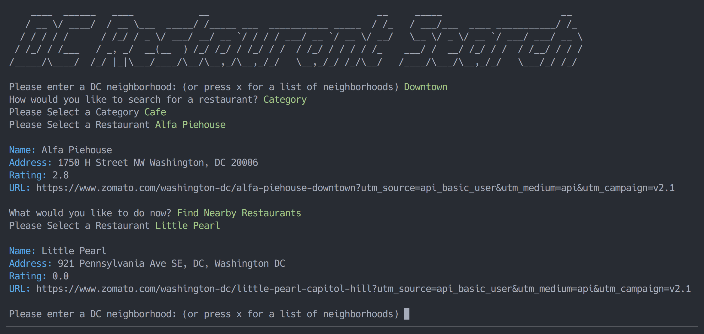

# restaurant-search-CLI
A simple command line program allowing you to search for restaurants in a given location, using a variety of parameters.

## Install

* Clone repository
* Run `bundle install`
* To load external data, obtain a [Zomato API key](https://developers.zomato.com/api).
* Create a file `app/api_key.rb` and add the contents `API_KEY = "YOUR_API_KEY"`
* Run `ruby bin/setup_db_data.rb`

## Usage

* Run `ruby bin/runner.rb`

## License

MIT